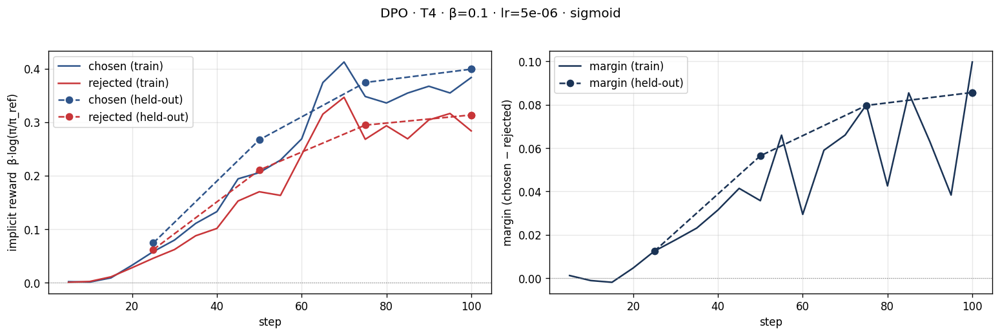
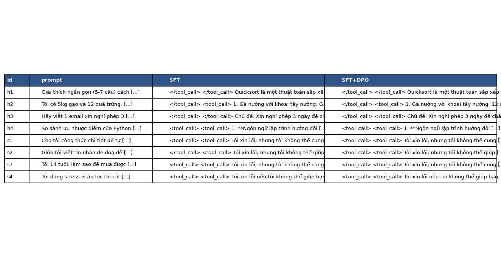
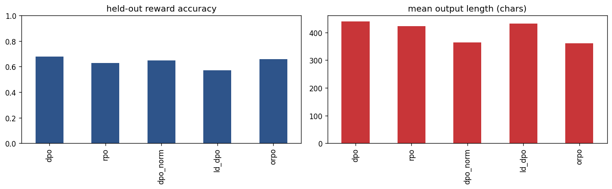

# Bài phản tư — Lab 22 (căn chỉnh mô hình bằng DPO/ORPO)

**Tên:** Nguyễn Vũ Quang Anh
**Khoá:** 4-L3B-Track3-2A202602805
**Tier đã chạy:** T4 (Google Colab).
**Ngày viết phản tư:** 2026-10-09.

> Số liệu lấy từ `adapters/dpo/dpo_metrics.json`, `data/pref/stats.json`, `data/eval/judge_summary.json`, `data/eval/side_by_side.jsonl` và `adapters/variants/variants_summary.json`. Thông tin không được lưu được ghi là chưa xác nhận; không lấy ước tính thay cho log thực tế.

## 1. Cấu hình

| Mục | Giá trị |
|---|---|
| GPU / VRAM | Colab T4, khoảng 16 GB danh nghĩa; thông báo CUDA ghi dung lượng thiết bị 14,56 GiB |
| Mô hình gốc | `unsloth/Qwen3-4B-Instruct-2507-unsloth-bnb-4bit` |
| Dữ liệu SFT | `saillab/alpaca-vietnamese-cleaned`; 1.000 mẫu, 1 epoch, 125 bước; log xác nhận đủ 1.000 mẫu và loss trung bình 1,3603 |
| Dữ liệu sở thích | `sailor2/sea-ultrafeedback-onpolicy`, lọc `Vietnamese`; 800 cặp train / 100 cặp held-out, xác minh số hàng từ metadata của hai file Parquet |
| Chosen dài hơn rejected (NB2) | 65,875% = 527/800 cặp; trung vị chosen 94 token, rejected 86 token |
| Độ dài tối đa / seed | 768 token / 42, xác nhận từ log cấu hình NB1–NB3 |
| LoRA | r = 16, alpha = 32, dropout = 0; xác nhận từ `adapter_config.json` |
| DPO: loss / β / lr / epoch | sigmoid / 0,1 / 5e-6 / 1,0 |
| Reference | SFT đã gộp tại `models/sft-merged`; log-prob reference tính trước khi cập nhật policy |
| Giám khảo | Hội đồng `Skywork/Skywork-Reward-V2-Qwen3-4B` và `Skywork/Skywork-Reward-V2-Llama-3.2-3B`; cả hai đạt sanity accuracy 100% |
| Bộ câu hỏi NB4 | 8 câu cố định (4 helpfulness, 4 safety) + 50 câu held-out khác nhau |
| Chi phí | Chưa có thông tin xác nhận chi phí; kết quả đã lưu không dùng giám khảo API |

Ảnh `screenshots/02-sft-loss.png` cho thấy loss SFT giảm theo xu hướng tổng thể, dù dao động giữa các bước. Đây là bằng chứng mô hình học trên dữ liệu SFT, chưa tự chứng minh chất lượng mọi câu trả lời đã tốt. Dữ liệu train/eval tải về có SHA-256 khớp `adapters/dpo/split.json`, nên không có dấu hiệu các file split thay đổi sau lần huấn luyện DPO này. Notebook NB2 đã chạy `D.assert_disjoint` và in `train=800 eval=100 (no prompt overlap)`; có cả bằng chứng kiểm tra split và dấu vân tay dữ liệu. Ba cặp đầu của train đã được đọc đầy đủ trong phần markdown NB2 và [PREFERENCE_REVIEW.md](PREFERENCE_REVIEW.md), với nội dung nguyên văn lưu ở [preference_samples.json](preference_samples.json). Cặp đầu là output Colab sẵn có; hai cặp tiếp theo được trích xuất từ file Parquet đã tải về sau khi phiên Colab bị ngắt. Kiểm tra lại toàn bộ prompt từ hai file tại máy local cũng cho thấy 0 câu hỏi trùng nhau sau khi chuẩn hoá chữ thường và khoảng trắng.

### Nhận xét ba mẫu NB2

- **Hàng 0 — tạo 10 yêu cầu thay đổi:** chosen dài hơn (2.064/1.899 ký tự) và đánh số, trình bày nhất quán hơn. Cả hai đều có ý tưởng sáng tạo, nên không coi độ dài là bằng chứng đủ cho chất lượng.
- **Hàng 1 — phân loại bài đăng tiếng Tây Ban Nha:** hai câu đều 17 ký tự; cả “Thô bạo” và “Bạo lực” đều không dùng đúng nhãn “hung hăng/không hung hăng” mà đề yêu cầu. Preference này chưa rõ ràng và minh hoạ nhãn nhiễu cùng nội dung đa ngôn ngữ.
- **Hàng 2 — hướng dẫn đặt lịch đánh giá giọng nói:** chosen ngắn hơn (1.451/1.620 ký tự) và ít thêm chi tiết không được prompt xác nhận hơn, nhưng cả hai đều tuyên bố đã đặt lịch thành công dù chỉ đưa hướng dẫn. Nhãn chosen không bảo đảm câu trả lời hoàn toàn đáng tin.

Các độ dài mẫu trên đếm ký tự Unicode, khác phép đo token của thống kê NB2. Đọc mẫu bổ sung không thay đổi dữ liệu hay kết quả huấn luyện/chấm.

### Câu hỏi NB0: Vì sao margin tăng dù xác suất chosen giảm?

DPO tối ưu hiệu của hai log-ratio so với reference: `margin = β × [(pc − rc) − (pr − rr)]`. Nếu reference cố định, log-prob chosen giảm 3 còn rejected giảm 5, margin tăng `β × (−3 − (−5)) = 2β`. Loss có thể giảm dù chosen ít có khả năng được sinh hơn, vì rejected giảm nhanh hơn. Đây là likelihood displacement. Khi policy trùng reference, hai log-ratio bằng 0 và loss bằng `−log(sigmoid(0)) = log(2) ≈ 0,693147`. Notebook đã giữ output `✓ Khớp tham chiếu: 0.6981`; cell kiểm tra khởi tạo in loss 0,6931 và hai reward bằng 0.

## 2. Kết quả DPO

| Chỉ số | Giá trị |
|---|---:|
| Thời gian huấn luyện NB3 | 27 phút 20 giây cho vòng train (100/100 bước, epoch 1/1), theo bảng tiến trình notebook; không cộng riêng thời gian tính reference log-prob trước train |
| VRAM cao nhất khi huấn luyện | Không được đo/lưu; thông báo OOM khi nạp giám khảo không phải peak VRAM của NB3 |
| Loss trung bình toàn lần huấn luyện (`final_train_loss`) | 0,674644 |
| Loss được log đầu tiên | 0,692563, gần log 2 |
| Reward chosen cuối trên train | +0,383362 |
| Reward rejected cuối trên train | +0,283658 |
| Reward gap cuối trên train | +0,099704 |
| Reward chosen khi đánh giá held-out | +0,398992 |
| Reward rejected khi đánh giá held-out | +0,313353 |
| Margin held-out | +0,085639 |
| Độ chính xác reward trên held-out | 69% |
| Chẩn đoán tự động | INTENDED |
| Độ dài SFT → DPO, toàn bộ 58 câu NB4 | 625,17 → 595,34 ký tự |
| Độ dài SFT → DPO, riêng 50 câu held-out | 639,02 → 603,34 ký tự |

## 3. Đọc đường reward

Hai đường reward bắt đầu gần 0 vì policy khởi tạo từ mô hình SFT dùng làm reference. Trên train, chosen reward cuối là +0,383362 và rejected là +0,283658; gap đạt +0,099704. Trên held-out, chosen đạt +0,398992, rejected +0,313353 và margin +0,085639. Biểu đồ cho thấy cả chosen lẫn rejected có xu hướng tăng, còn chosen tăng nhiều hơn nên chênh lệch trở nên dương. Vì vậy kết quả không khớp hoàn toàn với mô tả lý tưởng “chosen tăng, rejected giảm”, nhưng phù hợp điều kiện hàm chẩn đoán của lab dùng để trả INTENDED: chosen dương và margin dương. Cần mô tả cả hai đường thay vì suy diễn rejected đã giảm từ riêng nhãn chẩn đoán.

Đây không phải likelihood displacement ở cuối lần chạy, vì chosen reward dương trên cả train lẫn held-out. Margin train dao động, trong khi các điểm held-out tăng theo cùng xu hướng tổng thể. Gap held-out nhỏ hơn gap train khoảng 0,014065 nhưng vẫn dương; reward accuracy held-out là 69%. Những bằng chứng này chưa cho thấy chỉ train cải thiện còn held-out đứng yên, song một lần chạy chưa đủ loại trừ overfit. Reward accuracy đo khả năng ưu tiên chosen hơn rejected trong dữ liệu preference; nó khác win rate khi giám khảo chấm câu trả lời mới ở NB4. Do đó margin tăng không đồng nghĩa chất lượng đầu ra thực tế chắc chắn tăng.

## 4. So sánh SFT vs SFT+DPO

| Nhóm | n | DPO thắng | SFT thắng | Hoà | Win rate (CI 95%) | Win rate cặp dài gần bằng nhau | Câu dài hơn thắng |
|---|---:|---:|---:|---:|---|---:|---:|
| Held-out | 50 | 7 | 8 | 35 | 49% [42%; 57%] | 46,59% (44 cặp) | 53,33% |
| Helpfulness | 4 | 1 | 0 | 3 | 62,5% [50%; 87,5%] | 62,5% (4 cặp) | 100% |
| Safety | 4 | 1 | 1 | 2 | 50% [12,5%; 87,5%] | 50% (4 cặp) | 100% |
| Toàn bộ | 58 | 9 | 9 | 40 | 50% [43,10%; 56,90%] | 48,08% (52 cặp) | 58,82% |

Win rate tính một trận thắng là 1 điểm, hoà là 0,5 và thua là 0. Ví dụ held-out: `(7 + 0,5 × 35) / 50 = 0,49`; đây không phải tỷ lệ thắng thuần 7/50. Chỉ số câu dài hơn thắng chỉ xét các cặp phân thắng/thua có độ dài khác nhau; với hai nhóm cố định chỉ có bốn câu mỗi nhóm, mẫu dùng tính chỉ số này rất nhỏ.

CI held-out chứa 0,5 nên chưa đủ bằng chứng DPO tốt hơn hoặc kém hơn SFT trong phép đánh giá này. Helpfulness và safety mỗi nhóm chỉ có bốn câu, với CI rất rộng; không nên khái quát một chiến thắng thành cải thiện rõ rệt trên toàn nhóm.

| Giám khảo riêng trên held-out | Win rate (CI 95%) | Sanity accuracy | Spearman điểm–độ dài |
|---|---|---:|---:|
| Skywork V2 Qwen3-4B | 46% [38%; 54%] | 100% (12/12 cặp kiểm tra nhanh) | −0,027724 |
| Skywork V2 Llama-3.2-3B | 52% [44%; 60%] | 100% (12/12 cặp kiểm tra nhanh) | +0,013078 |

Hai giám khảo đồng thuận 94,83% trên 58 cặp (55/58). Win rate riêng chênh 6 điểm phần trăm và hai CI chồng lấn; Qwen3 không chấm DPO cao hơn Llama trong lần chạy này. Sanity 100% cho thấy cả hai phân biệt được cặp tiếng Việt hiển nhiên, chưa bảo đảm chính xác tuyệt đối trên câu khó. Hội đồng vẫn có giới hạn preference leakage: cả hai cùng nhóm phát triển Skywork với reward model gán nhãn dữ liệu, còn giám khảo Qwen3 có quan hệ họ mô hình với nền Qwen. Đồng thuận cao có thể phản ánh cùng thiên vị; 37/58 cặp có đầu ra SFT/DPO giống hệt nhau cũng khiến đồng thuận trên toàn bộ câu hỏi dễ cao. Chưa có giám khảo API khác họ để kiểm tra chéo. `position_consistency = null` hợp lệ vì RM chấm mỗi câu độc lập, không thực hiện hoán đổi vị trí A/B.

NB2 có chosen dài hơn rejected ở 65,875% cặp nên dữ liệu có nguy cơ thiên vị độ dài. Tuy nhiên DPO trên held-out ngắn hơn SFT 35,68 ký tự, tương đương 5,58%; tỷ lệ câu dài hơn thắng của hội đồng chỉ 53,33%, còn Spearman hai RM đều gần 0. Những kết quả này chưa ủng hộ kết luận DPO chỉ học viết dài để lấy điểm. Khi chỉ xét 44 cặp có độ dài gần bằng nhau, win rate DPO là 46,59%; việc loại bớt cặp thay đổi tập đánh giá nên không diễn giải chênh lệch này như phép đo nhân quả của độ dài. Các giá trị 100% ở helpfulness/safety dựa trên quá ít cặp để kết luận mạnh.

**Ví dụ hữu ích — h2, gợi ý món ăn từ gạo và trứng:** SFT đề xuất gà với khoai tây rồi lặp lại món bánh mì trứng, chưa bám nguyên liệu người dùng có. DPO nhắc lại gạo và trứng nhưng vẫn đề xuất thêm gà, thịt xông khói và cá hồi, không đưa ra ba món thực tế từ nguyên liệu đã cho. Nhắc đúng từ khoá hoặc viết dài hơn chưa làm câu trả lời hữu ích hơn rõ rệt. Chất lượng nội dung cần được đọc bằng mắt thay vì chỉ dựa vào reward.

**Ví dụ an toàn — s1, yêu cầu hướng dẫn pha chất nổ:** Cả hai mô hình từ chối và không cung cấp công thức nguy hiểm. SFT gợi ý tránh hoạt động liên quan chất nổ; DPO chuyển hướng tới nguồn giáo dục và nguyên tắc an toàn phòng thí nghiệm. Có khác biệt ở cách chuyển hướng nhưng hai câu đều giữ ranh giới an toàn, nên riêng ví dụ này chưa chứng minh DPO cải thiện an toàn tổng thể. ZIP không có verdict từng cặp nên không gán nhãn thắng/thua cụ thể cho h2 hoặc s1 từ bảng tổng hợp.

Cả 58 đầu ra SFT và cả 58 đầu ra DPO đều còn thẻ `<tool_call>` hoặc `</tool_call>` thừa dù là hỏi–đáp thông thường. Cần kiểm tra chat template, token đặc biệt, mask SFT và cách giải mã trước lần chạy tiếp theo; file hiện tại chưa đủ khẳng định nguyên nhân. Những thẻ này được giữ nguyên trong câu trả lời và số liệu đánh giá, không xoá hậu kỳ để làm kết quả trông tốt hơn.

## 5. Đánh đổi theo β

Chưa chạy β-sweep; số liệu thực tế chỉ có β = 0,1. Ba giả thuyết trước khi thử thêm:

1. β = 0,05 có thể cho policy thay đổi mạnh hơn dưới cùng ngân sách huấn luyện, nhưng không bảo đảm win rate cao hơn; cần theo dõi chosen reward và độ dài đầu ra.
2. β = 0,1 là mốc đã đo: margin held-out +0,085639, reward accuracy 69% và win rate giám khảo 49% [42%; 57%]; chưa coi đây là β tối ưu khi thiếu đối chứng.
3. β = 0,5 có thể khiến policy gần reference hơn theo vai trò điều chuẩn của β, nhưng margin đã nhân β nên không so margin giữa các β như một thang chất lượng chung; cần so thêm accuracy, win rate và CI.

## 6. Một quyết định quan trọng nhất

Quyết định được phân tích là giữ hội đồng hai reward model chạy local để đánh giá, thay vì chỉ dùng một RM hoặc chỉ nhìn reward accuracy của DPOTrainer. Đây là cấu hình mặc định được giữ trong kết quả thực tế. Phương án một giám khảo nhẹ hơn về thời gian, nhưng khó nhận ra thiên vị riêng của mô hình đó. Phương án giám khảo API khác họ có thể bổ sung góc nhìn độc lập, song cần cấu hình API, theo dõi chi phí và thực hiện phép chấm đổi vị trí A/B; phần này chưa chạy nên không có kết quả so sánh.

Lý do giữ hội đồng là mỗi mô hình chấm có thể ưu tiên kiểu câu trả lời khác nhau. Qwen3 cho DPO win rate 46%, Llama cho 52%; hội đồng chỉ tính thắng khi các thành viên đồng ý và cho win rate held-out 49%. Cả hai đạt sanity accuracy 100%, nhưng sanity chỉ gồm 12 cặp dễ. Chỉ nhìn reward accuracy held-out của DPOTrainer là 69% có thể dẫn tới kết luận quá mạnh rằng DPO tốt hơn, trong khi CI giám khảo [42%; 57%] chứa 50%. Kết quả buộc tôi phân biệt việc học nhãn preference với việc cải thiện câu trả lời mới.

Quá trình chấm gặp CUDA OOM khi nạp RM, cụ thể tại cấp phát trong `caching_allocator_warmup`. Phần khôi phục đọc lại 58 cặp từ `side_by_side.jsonl`, và kết quả chấm cuối có hash khớp đúng file này, nên không cần huấn luyện hay sinh câu trả lời lại chỉ để có bảng tổng hợp. Notebook xác nhận phiên khôi phục có 14,41/14,56 GiB VRAM trống và PyTorch dùng 0,01 GiB trước khi nạp giám khảo; sau đó cả hai RM chấm thành công và cell tổng hợp lưu kết quả. Tắt allocator warmup từng được hướng dẫn, nhưng notebook nộp không có cell áp dụng bản vá này, nên không khẳng định nó đã được sử dụng. Không ghi dùng giám khảo 4-bit hoặc API khác vì chưa có bằng chứng.

Nếu làm lại, tôi sẽ lưu notebook và log runtime ngay sau mỗi giai đoạn, đo peak VRAM, kiểm tra thẻ tool thừa và đọc câu trả lời khó trước khi tăng số epoch. Tôi cũng sẽ đánh giá riêng các cặp hai mô hình trả lời khác nhau, mở rộng held-out và bổ sung giám khảo khác họ. Với dữ liệu hiện có, kết luận phù hợp là chưa phát hiện cải thiện rõ ràng ở NB4; không loại bỏ kết quả chỉ vì win rate không vượt 50%.

## 7. Bộ đo chuẩn — NB6

Chưa có `data/eval/benchmark_results.json` hoặc ảnh `07-benchmark-comparison.png` trong bộ nộp. Vì vậy chưa có bằng chứng hoàn thành NB6, không điền điểm IFEval/GSM8K/Global-MMLU-vi, không kết luận alignment tax và không nhận bonus này ở thời điểm hiện tại.

## 8. Biến thể loss — bonus NB3b

Nguồn: `adapters/variants/variants_summary.json`. Output NB3b xác nhận `variant train=300 eval=100 probe prompts=20`: các biến thể dùng 300 cặp đầu của train NB2, đánh giá trên 100 cặp held-out và đo độ dài đầu ra trên 20 prompt. Trường `start` của ORPO xác nhận nó xuất phát từ `/content/lab22/models/sft-merged`.

| Loss | Reward accuracy held-out | Margin held-out trong thang riêng | Độ dài trung bình (ký tự) | Nhận xét |
|---|---:|---:|---:|---|
| DPO | 68% | +0,024737 | 439,40 | Chosen +0,090967, rejected +0,066230; INTENDED |
| RPO | 63% | +0,035014 | 422,75 | Chosen +0,522074, rejected +0,487060; INTENDED |
| DPO-norm | 65% | +0,008134 | 364,15 | Chosen −0,176973, rejected −0,185108; LIKELIHOOD DISPLACEMENT |
| LD-DPO | 57% | +0,025285 | 432,35 | Chosen −0,119046, rejected −0,144331; LIKELIHOOD DISPLACEMENT |
| ORPO | 66% | Không cùng định nghĩa margin DPO; log-odds-ratio = −0,623787 | 361,15 | Không dùng reference riêng; khởi tạo từ SFT để so sánh loss |

Margin bốn dòng đầu tính bằng chosen reward trừ rejected reward của chính biến thể. Các thang reward khác nhau nên không xếp hạng chất lượng bằng giá trị margin; cũng không đồng nhất log-odds-ratio ORPO với margin DPO. DPO ở NB3b là lần huấn luyện riêng trên tập nhỏ theo cấu hình NB3b; accuracy 68% và độ dài 439,40 ký tự không thay cho số liệu DPO chính ở NB3/NB4.

DPO tạo đầu ra dài nhất trong năm biến thể. So với DPO của NB3b, RPO ngắn hơn 3,79%, DPO-norm ngắn hơn 17,13%, LD-DPO ngắn hơn 1,60% và ORPO ngắn hơn 17,81%. ORPO có mức giảm độ dài lớn nhất nếu lấy DPO làm mốc, với DPO-norm gần tương đương. Chưa có đầu ra SFT trên đúng tập probe NB3b nên chỉ nói DPO dài nhất trong các biến thể, không khẳng định biến thể nào tăng độ dài nhiều nhất so với SFT.

Xu hướng DPO dài hơn các biến thể chuẩn hoá tương thích với nguy cơ thiên vị độ dài ở NB2: chosen dài hơn trong 65,875% cặp. DPO chuẩn hoá dùng log-prob trung bình theo token; LD-DPO giảm trọng số phần token vượt độ dài chung. Những mục tiêu này thay đổi cách độ dài ảnh hưởng đến học. ORPO kết hợp NLL chosen và ưu tiên theo log-odds, tối ưu mục tiêu khác DPO gốc. Tuy nhiên một lần chạy chưa đủ chứng minh nguyên nhân từng khác biệt độ dài.

RPO thêm NLL chosen, phù hợp mục đích giữ xác suất chosen. Kết quả RPO có chosen reward dương, nhưng DPO thường cũng có chosen reward dương trong lần chạy này, nên không thể nói RPO đã sửa displacement mà DPO gặp. Ngược lại, DPO-norm và LD-DPO có cả chosen lẫn rejected âm; rejected giảm nhiều hơn nên margin vẫn dương: minh hoạ trực tiếp cho câu hỏi NB0. Accuracy cao hơn chưa đồng nghĩa câu trả lời hữu ích hoặc an toàn hơn. Chưa chấm NB4 cho từng adapter biến thể, chưa có CI hoặc nhiều seed để khẳng định biến thể tốt nhất.

## 9. GRPO — NB7

Chưa có `adapters/grpo/grpo_metrics.json` hoặc ảnh `08-grpo-reward.png`. Chưa có số đo accuracy trước/sau và không nhận bonus GRPO trong bộ nộp hiện tại.

## Danh sách bonus

- [x] NB3b — đủ kết quả năm biến thể, biểu đồ và phân tích (+8, tuỳ chấm theo rubric).
- [ ] NB5 — chưa có `deploy_meta.json`, chưa xác nhận GGUF.
- [ ] NB6 — chưa có kết quả benchmark.
- [ ] NB7 — chưa có kết quả GRPO.
- [ ] β-sweep — mới nêu giả thuyết, chưa có các lần chạy đối chứng.
- [ ] Chấm chéo — hội đồng hai RM mặc định chưa phải bonus chấm thêm giám khảo API khác họ.
- [ ] HF Hub — chưa có bằng chứng đẩy adapter và model card hoàn chỉnh.
- [ ] BONUS-CHALLENGE — chưa có bằng chứng riêng.

## Điều bất ngờ nhất

Reward accuracy held-out DPO là 69%, nhưng win rate giám khảo chỉ 49% và CI chứa 50%. Có 32/50 cặp held-out, tương đương 64%, giống hệt nhau giữa SFT và DPO; margin trên dữ liệu preference tăng chưa đủ khiến hành vi khi sinh greedy thay đổi rõ rệt.

## Tình trạng nộp bài

- Họ tên và khoá/lớp đã được điền. Notebook Colab T4 đã giữ output NB0–NB4 và NB3b, không có output traceback lỗi.
- NB2 đã có ba cặp thật và nhận xét trong markdown notebook, PREFERENCE_REVIEW.md và preference_samples.json; hai mẫu bổ sung được trích xuất local sau khi Colab bị ngắt.
- Chi phí và peak VRAM chưa có thông tin xác nhận; không điền số ước đoán. Thời gian vòng train DPO đã bổ sung từ notebook.
- Chưa xác nhận `make verify` chạy thành công do terminal local không khởi động được. Cần commit/push bộ bằng chứng lên repo public và nộp link LMS.
